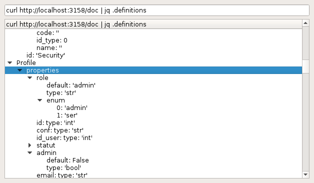
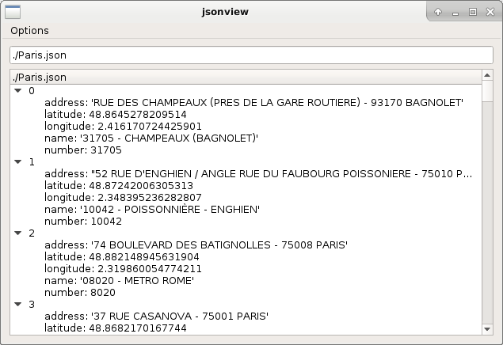
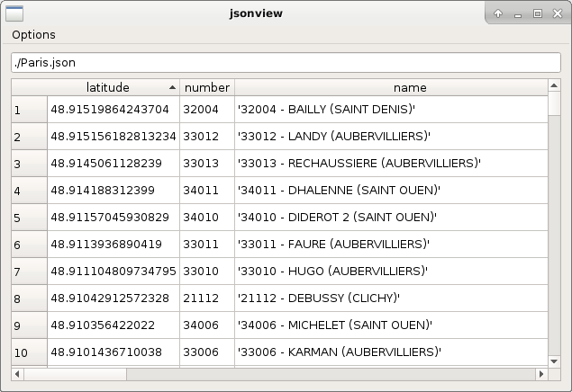

# jsonview

jsonview is a GUI JSON viewer.



## Sample usage

```
jsonview some_file.json

curl https://someurl | jsonview -

jq .something some_file.json | jsonview -
```

## Interface

If given a file name as argument, that JSON file will be viewed. If "-" is used as argument, stdin should contain JSON data.
If given no argument, jsonview will show an empty window at the beginning.

At the top of the GUI, a single text input is present. Put the path of a JSON file in this input and press enter and that file will be viewed.

If a command is put in this text input, the command will be run and the JSON result will be viewed.
This is useful to run `curl` or `jq` commands (or a combination of both, with a pipe in between) and view their result, without having to re-run jsonview.

### Table mode

If the data consists in a list of objects, it can be viewed in "table mode".

Normal tree mode:



Table mode:



## Dependencies

jsonview requires Python 3 and uses PyQt 6.

## License

jsonview is licensed under the WTFPLv2 license.
